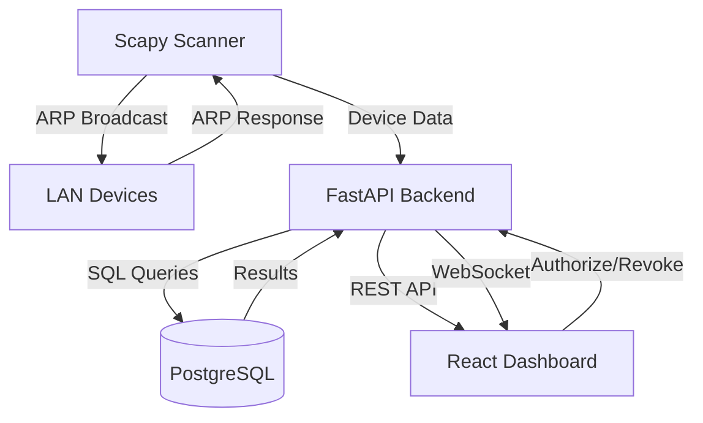

# 🛡️ Zero Trust Network Monitor

<div align="center">


**Real-time LAN monitoring tool with unauthorized device detection, anomaly alerts, and incident management dashboard.**

[Features](#-features) • [Architecture](#-architecture) • [Getting Started](#-getting-started) • [API Docs](#-api-endpoints) • [Tech Stack](#-tech-stack)

</div>

---

## 🎯 Features

| Feature | Description |
|---------|-------------|
| 📡 **ARP Network Scanning** | Discovers all active devices on the LAN using Scapy raw packets |
| 🛡️ **Zero Trust Authorization** | Whitelist/blacklist devices by MAC address |
| ⚡ **Real-time Alerts** | WebSocket-powered instant notifications for new devices |
| 🔍 **Anomaly Detection** | Detects port scans, suspicious ports (4444, 23, 3389) and traffic floods |
| 📋 **Incident Management** | Log, track and resolve security incidents with severity levels |
| 🌐 **Multi-interface Support** | Scan any network interface (Wi-Fi, Ethernet, WSL, etc.) |
| 📊 **Live Traffic Chart** | Real-time network traffic visualization with Recharts |
| 📖 **REST API** | Full FastAPI backend with auto-generated Swagger docs |

---

## 🏗️ Architecture

```
zero-trust-network-monitor/
├── backend/
│   ├── Dockerfile
│   ├── requirements.txt
│   └── app/
│       ├── main.py
│       ├── api/
│       │   └── routes.py
│       ├── core/
│       │   ├── scanner.py
│       │   └── database.py
│       ├── models/
│       │   └── device.py
│       └── services/
│           └── detector.py
├── frontend/
│   ├── index.html
│   ├── vite.config.ts
│   └── src/
│       ├── App.tsx
│       ├── main.tsx
│       └── index.css
├── docker-compose.yml
├── .env.example
└── README.md
```

## 🔄 How It Works



## 🚀 Getting Started

### Prerequisites

- Python 3.11+
- Node.js 18+
- Docker Desktop
- [Npcap](https://npcap.com) (Windows) or libpcap (Linux/macOS)
- Administrator/root privileges (required for ARP scanning)

### 1. Clone the repository

```bash
git clone https://github.com/VladimirRamirez07/zero-trust-network-monitor.git
cd zero-trust-network-monitor
```

### 2. Configure environment

```bash
cp .env.example .env
# Edit .env and set your NETWORK_RANGE (e.g. 192.168.0.0/24)
```

### 3. Start PostgreSQL

```bash
docker-compose up -d db
```

### 4. Start the backend (run as Administrator)

```bash
cd backend
pip install -r requirements.txt
python -m uvicorn app.main:app --host 127.0.0.1 --port 8001
```

### 5. Start the frontend

```bash
cd frontend
npm install
npm run dev
```

### 6. Open the dashboard
http://localhost:5173
---

## 🔌 API Endpoints

| Method | Endpoint | Description |
|--------|----------|-------------|
| `GET` | `/api/v1/devices` | List all detected devices |
| `GET` | `/api/v1/devices/unauthorized` | List unauthorized devices |
| `POST` | `/api/v1/devices/{mac}/authorize` | Authorize a device |
| `POST` | `/api/v1/devices/{mac}/revoke` | Revoke device authorization |
| `POST` | `/api/v1/scan?network=x.x.x.x/24` | Trigger ARP network scan |
| `GET` | `/api/v1/incidents` | List all incidents |
| `POST` | `/api/v1/incidents/{id}/resolve` | Resolve an incident |
| `GET` | `/api/v1/interfaces` | List available network interfaces |
| `WS` | `/api/v1/ws/alerts` | WebSocket for real-time alerts |

> 📖 Full interactive docs at `http://localhost:8001/docs`

---

## 🔍 Detection Engine

### Unauthorized Device Detection
Every device starts as **unauthorized**. Any new MAC address triggers an instant WebSocket alert to the dashboard

### Anomaly Detection Rules

| Type | Trigger | Severity |
|------|---------|----------|
| Unauthorized device | MAC not in whitelist | 🔴 High |
| Suspicious port access | Ports: 4444, 31337 (metasploit) | 🔴 Critical |
| Suspicious port access | Ports: 22, 23, 3389, 5900 | 🟠 Medium |
| Traffic flood | >500 packets/min from one IP | 🟠 High |

---

## 🛠️ Tech Stack

| Layer | Technology | Purpose |
|-------|-----------|---------|
| Packet Capture | Scapy 2.5 | ARP scanning & traffic analysis |
| Backend Framework | FastAPI + Uvicorn | REST API & WebSocket server |
| ORM | SQLAlchemy 2.0 | Database models & queries |
| Database | PostgreSQL 15 | Persistent storage |
| Frontend | React 18 + TypeScript | Dashboard UI |
| Build Tool | Vite 5 | Frontend bundler |
| Charts | Recharts | Traffic visualization |
| Icons | Lucide React | UI icons |
| Container | Docker Compose | PostgreSQL deployment |

---

## ⚠️ Disclaimer

This tool is intended for **authorized network monitoring only**. Only use it on networks you own or have explicit permission to monitor. Unauthorized network scanning may be illegal in your jurisdiction.

---

## 📄 License

MIT License — see [LICENSE](LICENSE) for details.

---

<div align="center">
Made with ❤️ for cybersecurity portfolio
</div>